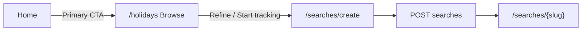

# Browse holidays approach

## Context

- Today the homepage ([`resources/views/welcome.blade.php`](resources/views/welcome.blade.php)) leads with **Create Your Search** and **View Saved Searches**; navigation in [`resources/views/components/layouts/app-shell.blade.php`](resources/views/components/layouts/app-shell.blade.php) centres on **My Searches** and **New Search**.
- Customer flows live under [`routes/web.php`](routes/web.php) as `searches.*`; [`SearchController::index`](app/Http/Controllers/SearchController.php) powers **My Saved Searches** ([`resources/views/searches/index.blade.php`](resources/views/searches/index.blade.php)) — not a holiday catalogue.
- Scoring is always relative to a [`SavedHolidaySearch`](app/Models/SavedHolidaySearch.php): [`ScoredHolidayOption`](app/Models/ScoredHolidayOption.php) belongs to a search/run. A generic “browse” grid cannot show a personalised **/10** score without a search context; [`recommendation-card`](resources/views/searches/partials/recommendation-card.blade.php) is built around [`ResultCardViewModel`](app/ViewModels/ResultCardViewModel.php) (rank + score).
- [`HolidayPackage`](app/Models/HolidayPackage.php) (+ `hotel` + photos) is the right source if you want a **live** browse experience (price, dates, destination, provider) **without** a score until the user starts or attaches a search.
- The v0 URLs you shared (`https://vm-6n9sc6whvgab0y88s1hq7u0j.vusercontent.net/` and `/holidays`) currently resolve to a **Vercel login** gate in practice, so visual parity should be driven by your exported screenshots or a public preview — not assumed from the link alone.

## Recommended product mapping

Treat **Browse** as the **top-of-funnel** discovery step, and keep **saved search + scoring** as the **engine** once the user commits. That matches [`docs/HolidaySage_Cursor_Ready_Build_Spec.md`](docs/HolidaySage_Cursor_Ready_Build_Spec.md) (“recommendations, not simply list holidays”) while still matching a v0-style `/holidays` index.

## Phase 1 — Routes, IA, and funnel (low risk)

1. **Add a named route** e.g. `GET /holidays` → `holidays.index` (controller name up to you: `HolidayBrowseController` keeps `SearchController` smaller).
2. **New Blade view** e.g. [`resources/views/holidays/index.blade.php`](resources/views/holidays/index.blade.php) using the same [`x-layouts.app-shell`](resources/views/components/layouts/app-shell.blade.php), typography, and card patterns from the existing UI plan ([`.cursor/plans/frontend-customer-ui-plan_c3f8c50d.plan.md`](.cursor/plans/frontend-customer-ui-plan_c3f8c50d.plan.md)).
3. **Homepage** — primary CTA **Browse holidays** → `route('holidays.index')`; keep a clear secondary path to **Create a search** (or **My searches**) so returning users are not blocked.
4. **App shell** — add a **Browse** (or **Holidays**) nav item pointing at `holidays.index`; decide whether **New Search** remains the right-hand primary button or becomes secondary to **Browse** (v0 suggests browse-first).
5. **Prefill from browse → create** — [`searches/create`](resources/views/searches/create.blade.php) currently only uses `old(...)` for field defaults. Extend [`SearchController::create`](app/Http/Controllers/SearchController.php) to pass a small **whitelist** of query parameters into the view (e.g. `departure_airport_code`, `travel_start_date`, `travel_end_date`, `duration_min_nights`, `duration_max_nights`, `adults`, `children`, and optionally `feature_preferences[]` / `destination_preferences[]` matching [`StoreSavedHolidaySearchRequest`](app/Http/Requests/StoreSavedHolidaySearchRequest.php)). Use `old('key', $prefill['key'] ?? $default)` in the Blade inputs so validation errors still win. Browse chips/cards link to `route('searches.create', [...])` with those query keys.
6. **Tests** — feature test: `GET /holidays` 200; `GET /searches/create?...` asserts inputs receive prefilled values; homepage asserts primary CTA target.

## Phase 2 — Optional live “holiday grid” (higher scope)

Only if the v0 `/holidays` page is literally a **paginated catalogue** of deals:

1. **Query layer** — new action/service querying `HolidayPackage::query()->with(['hotel.photos', 'providerSource'])` with filters (destination/resort from `hotels`, date range, nights, airport, provider). Dedupe strategy matters: e.g. latest package per `hotel_id` + month, or per `signature_hash`, to avoid an enormous near-duplicate grid.
2. **New view model** — e.g. `PackageBrowseCardViewModel` (image, hotel, resort/country, dates, nights, price, provider badge) — **omit** the green score badge or replace with neutral copy (“Score after you start a search”).
3. **Card actions** — primary CTA **Start tracking** → `searches.create` with query prefills derived from the package (and optionally hidden `provider_import_url` if you ever want to deep-link a provider list URL from the package — only if data supports it cleanly).
4. **Empty / privacy note** — [`SearchController::index`](app/Http/Controllers/SearchController.php) currently lists all saved searches without `user_id` scoping; the same single-tenant assumption applies to any global package browse until auth-scoped listings exist. Document or fix scoping when multi-user behaviour is required.

## Copy and spec drift

Update the “v0 Style Parity Guardrails” section in the frontend plan (when you next edit docs) so primary CTA language matches **Browse holidays** rather than only “Tell us about your perfect holiday” as the first click — the narrative order in [`welcome.blade.php`](resources/views/welcome.blade.php) “How it works” can stay, with one line adjusted if browse becomes the main story.

## What I would not do in v1 of Browse

- Do **not** reuse [`recommendation-card`](resources/views/searches/partials/recommendation-card.blade.php) for non-scored rows without a redesign — it would misrepresent the product (fake scores or confusing blanks).
- Do **not** rename `searches.index` to `/holidays` without redirects — bookmarks and the build spec refer to saved searches explicitly; keep **My searches** at `/searches` and use **`/holidays` for browse** as in v0.
