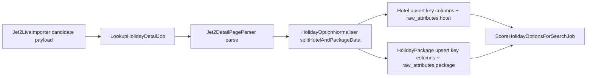

# Jet2 CSV Field Enrichment Plan

## Goal
Extend the current hotel/package model so high-value attributes (for filtering, ranking, and display) become queryable columns, while preserving all other extracted values in structured JSON for future promotion.

## Scope (Phase 1)
- Provider: Jet2 only.
- Storage strategy: key fields as columns; long-tail fields in `raw_attributes` namespaces.
- Pipeline touchpoints: detail parser output, normaliser split/upsert, model casts/fillables, and scoring/filter readiness.
- Source-of-truth extraction logic: Python Beachin implementation and its emitted field semantics.

## Source of Truth (No Guessing)
- Mirror the Python Beachin parsing and typing rules first, then map into Laravel models.
- Any field not confidently derivable from current Jet2 payloads must remain `null` or JSON raw, not inferred heuristically unless Beachin already does so.
- Create a parity checklist where each promoted field references the corresponding Beachin extraction source and transform rule.

## Field Mapping (Phase 1)
- **Hotel-level columns (queryable now):**
  - `blocks_count`, `floors_count`, `rooms_count`
  - `restaurants_count`, `bars_count`, `pools_count`, `sports_leisure_count`
  - `distance_to_airport_km` (decimal)
  - `has_lift`, `ground_floor_available`, `accessibility_issues` (nullable booleans)
- **Package-level columns (queryable now):**
  - `local_beer_price`, `three_course_meal_for_two_price` (decimal, GBP)
  - `board_recommended` (string/enum-like text)
  - `outbound_flight_time_text`, `inbound_flight_time_text` (string)
- **Stay in structured JSON (phase 1):**
  - free-text/verbose fields: `accessibility_notes`, `introduction_snippet`, `key_selling_points`, `style_keywords`, `rooms_seaview_balcony`
  - optional transfer heuristics and derived estimates unless required by filtering

## Proposed Data Flow

## Implementation Steps
1. **Schema expansion (non-breaking, nullable-first)**
   - Add a migration for hotel and package key fields above, all nullable/default-safe.
   - Keep existing unique keys and signatures unchanged.
   - Files to update:
     - [/Users/wade/Sites/holidaysage/database/migrations](/Users/wade/Sites/holidaysage/database/migrations) (new migration)

2. **Model updates**
   - Add new fields to fillables/casts in:
     - [/Users/wade/Sites/holidaysage/app/Models/Hotel.php](/Users/wade/Sites/holidaysage/app/Models/Hotel.php)
     - [/Users/wade/Sites/holidaysage/app/Models/HolidayPackage.php](/Users/wade/Sites/holidaysage/app/Models/HolidayPackage.php)
   - Use nullable boolean and numeric casts so unknown stays `null`.

3. **Parser extraction contract (Jet2 detail)**
   - Extend parser output with new canonical keys (typed where possible) to match Beachin semantics.
   - Parse counts/prices from Jet2 structured attributes first; only use text heuristics where Beachin already uses equivalent heuristics.
   - File:
     - [/Users/wade/Sites/holidaysage/app/Services/ProviderImport/DetailParsers/Jet2DetailPageParser.php](/Users/wade/Sites/holidaysage/app/Services/ProviderImport/DetailParsers/Jet2DetailPageParser.php)

4. **Normaliser split and upsert mapping**
   - Route each extracted key into hotel vs package payloads.
   - Preserve all non-promoted keys under `raw_attributes.hotel_extra` / `raw_attributes.package_extra`.
   - File:
     - [/Users/wade/Sites/holidaysage/app/Services/Normalisation/HolidayOptionNormaliser.php](/Users/wade/Sites/holidaysage/app/Services/Normalisation/HolidayOptionNormaliser.php)

5. **Scoring/filter-readiness alignment**
   - Keep current scoring stable; add guarded optional reads for new fields only where already meaningful (e.g. accessibility signals, size).
   - Do not make new fields mandatory for scoring.
   - File:
     - [/Users/wade/Sites/holidaysage/app/Services/Scoring/DefaultHolidayScorer.php](/Users/wade/Sites/holidaysage/app/Services/Scoring/DefaultHolidayScorer.php)

6. **Validation + parity checks**
   - Run sync import on representative Jet2 URL.
   - Compare fill-rate and sample values for promoted fields against CSV expectations and Beachin outputs for the same URLs.
   - Add/extend focused tests for parser + normaliser mappings and nullable behaviour.
   - Record explicit field-level parity outcomes (`match`, `intentional divergence`, `not available in source`).
   - Likely test files:
     - [/Users/wade/Sites/holidaysage/tests](/Users/wade/Sites/holidaysage/tests)

## Acceptance Criteria
- New promoted fields persist to correct table (`hotels` vs `holiday_packages`) without breaking dedupe/upsert behaviour.
- Unknown values remain `null` (never coerced to false/zero placeholders unless source is explicit).
- All non-promoted extracted data is still retained in structured `raw_attributes`.
- Existing import/score pipeline completes successfully for Jet2 with no regression in run counts.

## Risks and Mitigations
- **Risk:** Over-promoting unstable text-derived fields creates noisy filters.
  - **Mitigation:** Promote only deterministic fields now; keep long-tail in JSON.
- **Risk:** Parser differences between list/detail payload variants.
  - **Mitigation:** Prefer structured data precedence, add fallback guards and tests for both shapes.
- **Risk:** Type drift (currency/text numbers).
  - **Mitigation:** central parse helpers for booleans, ints, decimals, and currency strings.
