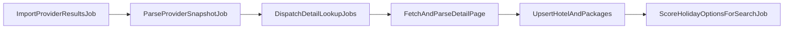

# Detail Page Enrichment Plan

## Outcome
For each imported candidate URL, dispatch a detail enrichment job that fetches/parses the hotel detail page and upserts richer data into `hotels` and `holiday_packages` (including multiple packages per hotel when present), then score from enriched package rows.

## Current Gap (Why Nulls Exist)
- Current Jet2 flow writes mostly Smartsearch API fields in `[app/Services/ProviderImport/Importers/Jet2LiveImporter.php](/Users/wade/Sites/holidaysage/app/Services/ProviderImport/Importers/Jet2LiveImporter.php)`.
- Python parser enriches extra fields from detail HTML/JSON-LD/overview text in `[src/parsers/jet2.py](/Users/wade/Sites/beachin/src/parsers/jet2.py)`.
- Result: hotel enrichment fields (`review_*`, distances, geo) are missing in Laravel.

## Architecture Changes

## Implementation Steps

### 1) Add detail parsing contract + provider implementations
- Add a new contract, e.g. `ProviderDetailPageParser` with methods:
  - `supports(providerKey)`
  - `parse(candidate, html)` returning enriched hotel attrs + package list.
- Add Jet2 parser implementation that mirrors Python extraction patterns from `[src/parsers/jet2.py](/Users/wade/Sites/beachin/src/parsers/jet2.py)`:
  - JSON-LD `aggregateRating` (`review_score`, `review_count`)
  - `data-resort` / `data-area`
  - overview text regexes for transfer/distances/facilities
  - URL path location fallback (already partially present).
- Keep parser output normalised to current Laravel field names used by `[app/Services/Normalisation/HolidayOptionNormaliser.php](/Users/wade/Sites/holidaysage/app/Services/Normalisation/HolidayOptionNormaliser.php)`.

### 2) Add detail lookup job fan-out
- Add `LookupHolidayDetailJob` (queueable) with payload: `runId`, `searchId`, `providerSourceId`, `candidate`.
- In `[app/Jobs/ParseProviderSnapshotJob.php](/Users/wade/Sites/holidaysage/app/Jobs/ParseProviderSnapshotJob.php)`, replace direct `NormaliseHolidayCandidateJob` batching with:
  - batch of `LookupHolidayDetailJob` per candidate URL,
  - `then()` dispatch `ScoreHolidayOptionsForSearchJob`.
- Add timeout/retry controls and conservative concurrency for provider safety.

### 3) Upsert enriched hotel + packages (including multiple packages)
- In `LookupHolidayDetailJob`:
  - fetch detail page HTML via provider-specific HTTP client,
  - parse enriched hotel + package list,
  - for each parsed package, call `HolidayOptionNormaliser::normaliseAndSign + upsert`.
- Update run tracking to append all produced package IDs (not just one per candidate) in `[app/Models/SavedHolidaySearchRun.php](/Users/wade/Sites/holidaysage/app/Models/SavedHolidaySearchRun.php)` usage path.

### 4) Data-model semantics improvements
- Move hotel booleans to tri-state meaning in practice:
  - avoid defaulting unknown facility fields to `false` during enrichment; only set `true/false` when confidently parsed.
- Keep package uniqueness as currently implemented (search-focused signature), but include extra package dimensions if detail parsing exposes disambiguators (flight/board/room options).

### 5) Scoring compatibility
- Keep `[app/Jobs/ScoreHolidayOptionsForSearchJob.php](/Users/wade/Sites/holidaysage/app/Jobs/ScoreHolidayOptionsForSearchJob.php)` as package-centric.
- Ensure scorer has the enriched hotel relationship loaded (already `with('hotel')`) so newly populated hotel fields influence scoring naturally.

## Validation Plan
- Use same Jet2 URL and run `--sync`.
- Verify:
  - counts still reconcile (`raw/parsed/normalised/scored`),
  - hotels/packages dedupe remains stable across repeated runs,
  - previously null-heavy hotel columns (`review_score`, `review_count`, distance/geo/facilities) show materially better fill rates.
- Compare Laravel enriched snapshots against Python parser outputs for a sample of 10 hotels:
  - country, review fields, distances, facility flags, and package price consistency.

## Files Expected To Change
- Pipeline/jobs:
  - `[app/Jobs/ParseProviderSnapshotJob.php](/Users/wade/Sites/holidaysage/app/Jobs/ParseProviderSnapshotJob.php)`
  - new `LookupHolidayDetailJob` in `app/Jobs/`
- Parsing/import services:
  - new provider detail parser(s) under `app/Services/ProviderImport/`
  - `[app/Services/ProviderImport/Importers/Jet2LiveImporter.php](/Users/wade/Sites/holidaysage/app/Services/ProviderImport/Importers/Jet2LiveImporter.php)` (if shared fetch helpers are extracted)
- Normalisation/upsert:
  - `[app/Services/Normalisation/HolidayOptionNormaliser.php](/Users/wade/Sites/holidaysage/app/Services/Normalisation/HolidayOptionNormaliser.php)`
- Optional model migration if tri-state booleans are introduced in schema defaults.
