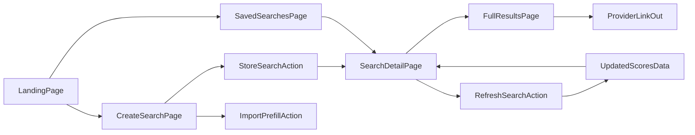

# HolidaySage Frontend Customer UI Implementation Plan

## Objective
Deliver a production-ready customer-facing UI that follows the v0 POC journey (`/` → create search → saved searches → results detail), while staying aligned with the product principles and domain model in [`/Users/wade/Sites/holidaysage/docs/HolidaySage_Project_Plan.md`](/Users/wade/Sites/holidaysage/docs/HolidaySage_Project_Plan.md) and [`/Users/wade/Sites/holidaysage/docs/HolidaySage_Cursor_Ready_Build_Spec.md`](/Users/wade/Sites/holidaysage/docs/HolidaySage_Cursor_Ready_Build_Spec.md).

## Design Direction and UI Principles
- Product tone: calm, confident decision support rather than “deal aggregator”.
- Layout rhythm: large breathable spacing, clear section breaks, one primary CTA per section.
- Content hierarchy: recommendation trust first, comparison detail second, mechanical metadata last.
- Density rules:
  - mobile: one-column cards, stacked stat chips, sticky bottom CTA on forms.
  - desktop: max content width `1200px`, two-column where it improves scanning, never more than three visual columns.
- Accessibility baseline:
  - all score/alert states must use icon + text, not colour only.
  - keyboard focus ring visible on all controls.
  - contrast targets meet WCAG AA.

## v0 Style Parity Guardrails
- Match the v0 UX language and composition from [`https://v0-holidaysage-web-app.vercel.app/`](https://v0-holidaysage-web-app.vercel.app/), including the same page narrative order and CTA naming.
- Preserve key headline/copy tone:
  - “Find your perfect holiday, effortlessly”
  - “Tell us about your perfect holiday”
  - “My Saved Searches”
  - “Top recommended options” framing.
- Keep recommendation cards “proof-first” in this sequence:
  - rank + provider
  - hotel/destination
  - score
  - travel facts
  - feature chips
  - recommendation summary
  - price block
  - `View Deal`.
- Use compact metric strips and pill chips rather than heavy table layouts.
- Enforce consistent rounded card UI, soft border, subtle shadow, and high whitespace similar to the v0 visual weight.

## Visual Style System (MVP)
- Typography:
  - headings: bold, compact line-height, strong contrast.
  - body: medium-weight readable text for confidence and clarity.
  - metadata: smaller neutral text with reduced emphasis.
- Colour intent:
  - primary brand: sky/teal gradient accents.
  - trust/success: green/teal badges for “improving” and positive status.
  - caution: amber for trade-offs/warnings.
  - neutral surfaces: soft slate backgrounds with white content cards.
- Elevation:
  - Level 0: page background with subtle gradient wash.
  - Level 1: standard cards (search card, result card).
  - Level 2: “Top pick” and key CTA panels with stronger shadow/ring.
- Component shape:
  - rounded corners (`xl/2xl`), subtle borders, restrained shadows.
  - consistent pill chips for preferences, status, provider labels.

## Iconography Specification (Lucide-Aligned)
- Standardise on Lucide icon set to mirror v0/shadcn visual language:
  - Laravel Blade option: `blade-ui-kit/blade-lucide`.
  - Vite/JS option: `lucide` package with inline SVG rendering.
- Icon usage rules:
  - 16px for metadata rows, 18–20px for chip icons, 20–24px for section accents.
  - 1.75–2px stroke style for consistent clarity.
  - pair every icon with text label for status-critical meaning.
- Initial icon mapping:
  - family friendly: `Users`
  - near beach: `Waves`
  - walkable area: `Footprints`
  - swimming pool: `WavesLadder` (fallback `Waves`)
  - kids club: `PartyPopper`
  - adults only: `Wine`
  - all inclusive/board: `UtensilsCrossed`
  - quiet & relaxing: `Leaf`
  - nightlife: `Music4`
  - spa & wellness: `Sparkles`
  - flight time: `Plane`
  - transfer time: `Car`
  - warning/trade-off: `TriangleAlert`
  - improving trend: `TrendingUp`
  - refresh/status: `RefreshCw` / `Clock3`

## Shared Layout Framework
- `AppShell`:
  - Top nav: logo, “My Searches”, primary CTA (“New Search”), auth/profile area if available.
  - Main container: centred max-width content area.
  - Footer: concise positioning message.
- `SectionHeader` pattern:
  - title
  - optional supporting line
  - optional right-side action cluster
- Global feedback:
  - inline validation errors
  - page success toast/banner for create/refresh actions
  - empty-state modules with action CTA

## Route and View Map
- Rework landing in [`/Users/wade/Sites/holidaysage/resources/views/welcome.blade.php`](/Users/wade/Sites/holidaysage/resources/views/welcome.blade.php).
- Add views under `resources/views/searches/`:
  - `create.blade.php`
  - `index.blade.php`
  - `show.blade.php`
  - `results.blade.php`
  - `partials/` for shared blocks
- Expand [`/Users/wade/Sites/holidaysage/routes/web.php`](/Users/wade/Sites/holidaysage/routes/web.php):
  - `GET /`
  - `GET /searches`
  - `GET /searches/create`
  - `POST /searches`
  - `GET /searches/{search}`
  - `GET /searches/{search}/results`
  - `POST /searches/import`
  - `POST /searches/{search}/refresh`

## Page-by-Page Specification

## 1) Landing Page (`GET /`)
### Purpose
Communicate the value proposition in under 10 seconds and route users into action.

### Content Blocks (top to bottom)
- **Hero**
  - headline matching v0 concept.
  - short supporting paragraph.
  - primary CTA: `Create Your Search`.
  - secondary CTA: `View Saved Searches`.
- **How it works (3-step)**
  - Define preferences.
  - Continuous tracking.
  - Ranked recommendations.
- **Why HolidaySage**
  - three-to-four trust bullets with short proof text.
- **Sample Result Preview**
  - one static top-pick card preview to set expectation.
- **Bottom CTA band**
  - “Create your first search in under 2 minutes”.

### Layout Rules
- Desktop: hero left (copy/CTAs), right (preview panel).
- Mobile: stacked hero with CTAs full-width.
- Max two CTA buttons in hero; do not add tertiary actions.

### Styling Rules
- high-contrast hero title.
- background gradients remain subtle and non-distracting.
- sample card mirrors actual result card styling to reduce mismatch.
- include small Lucide accents for “How it works” steps and “Why use HolidaySage” bullets.

## 2) Create Search Page (`GET /searches/create`)
### Purpose
Capture intent quickly and clearly; form should feel like preference setup, not booking checkout.

### Content Blocks
- **Page intro**
  - title and short helper text.
- **Optional Import Panel**
  - URL input + `Import` button.
  - helper copy: supported providers.
  - success/failure inline state.
- **Core Criteria Form**
  - search name
  - departure airport
  - earliest departure / latest return
  - duration min/max
  - party composition
  - budget
  - max flight/transfer
- **Preferences Selector**
  - chip-based multi-select grouped by category (family, location, board, atmosphere).
- **Action Row**
  - primary submit: `Find My Best Holiday Options`.
  - secondary cancel/back.
  - trust strip (providers tracked, 24/7, smart recommendations).

### Layout Rules
- Desktop: form as two-column grid; full-width rows for complex groups.
- Mobile: single-column; sticky footer action with submit button.
- Validation appears directly under each field and in a top summary if multiple errors.

### Styling Rules
- required fields visually distinct but not noisy.
- preference chips toggle clearly across selected/unselected/disabled states.
- import panel visually separated using light-tinted card.
- preference options should render with Lucide icons (not emoji) to match v0 component style consistency.

## 3) Saved Searches Index (`GET /searches`)
### Purpose
Give a quick portfolio view of tracked searches and direct users to the most relevant one.

### Content Blocks
- **Header**
  - title, short explanatory copy, `New Search` CTA.
- **Search Card Grid/List**
  - each card includes:
    - search name
    - summary line (airport, dates, party, preferences)
    - status badge (`active`, `paused`, etc.)
    - freshness (`updated X ago`)
    - result count
    - trend badge (`improving`, `stable`, `declining` where available)
    - primary action: `View Results`
- **Guidance Panel**
  - short trust reminders (check regularly, alerts later, trust score rationale).

### Layout Rules
- Desktop: 2-column card grid (3 only if card readability remains high).
- Mobile: single-column card stack with full-width tap targets.
- Most recently updated active searches sorted first by default.

### Styling Rules
- cards must be scannable in under 3 seconds.
- trend/status pills use colour + icon + text.
- avoid large paragraph blocks within cards.
- keep card title, update age, options found, and “Improving” badge visual balance aligned to v0 card rhythm.

## 4) Search Detail Page (`GET /searches/{search}`)
### Purpose
Act as the daily decision page for one search: quick status, top recommendation, ranked shortlist.

### Content Blocks
- **Search Summary Header**
  - search title + status badge.
  - criteria summary row.
  - actions: `Refresh`, `View Full Results`, optional `Edit Search`.
- **Top Pick Panel**
  - emphasised card with:
    - score
    - hotel/destination/provider
    - price and per-person
    - key evidence chips
    - recommendation summary
    - warning highlights if any
    - `View Deal` CTA
- **Ranked Shortlist (Top 3–5)**
  - compact recommendation cards with reasons and trade-offs.
- **Run Freshness / Improvement Signal**
  - “updated X ago”, “N improved since yesterday”.
- **Recent Run Activity Snippet**
  - small timeline or list of last few run statuses.

### Layout Rules
- Desktop: top pick full-width; shortlist below in vertical stack.
- Mobile: maintain rank clarity with visible rank markers and consistent card order.
- Refresh and full-results actions remain above the fold.

### Styling Rules
- top pick must be visibly distinct but stylistically consistent with other cards.
- rank numbers and score badges remain visually dominant anchors.
- warning flags are concise chips or bullets, not long paragraphs.
- maintain v0-like “updated recently” and “improved since yesterday” info strip directly above ranked results.

## 5) Full Results Page (`GET /searches/{search}/results`)
### Purpose
Offer complete ranked comparison without losing recommendation context.

### Content Blocks
- **Header and Controls**
  - back link to search detail.
  - search summary.
  - optional simple sort toggles for MVP-safe options (e.g. rank, price).
- **Results List**
  - full recommendation card per option:
    - rank and score
    - provider/hotel/destination
    - travel facts (flight, transfer, nights, board)
    - price block
    - recommendation reasons
    - warning flags
    - `View Deal` link
- **Pagination or “Show more”**
  - progressive disclosure to keep initial load light.

### Layout Rules
- Desktop: card body can split into information columns (facts, rationale, pricing/actions).
- Mobile: stacked sections with clear subhead labels.
- Keep filters/sorting lightweight; avoid advanced faceted search in MVP.

### Styling Rules
- maintain consistent card anatomy with detail page.
- emphasise readability of reasons/trade-offs over visual decoration.
- disqualified or low-confidence options (if shown) use clearly muted styling.
- preserve v0 card action hierarchy: primary card content first, `View Deal` as clear final action.

## Shared Component Blueprint
- `SearchSummaryBar`: reusable one-line summary and status/freshness chips.
- `PreferenceChipGroup`: selectable chips with icon + text + selected state.
- `ScoreBadge`: numeric score + confidence styling tiers.
- `RecommendationCard`: base card used in detail and results pages.
- `TopPickPanel`: wrapper variant of `RecommendationCard` with elevated styling.
- `WarningFlagsList`: concise trade-off list with caution iconography.
- `RunFreshnessIndicator`: updated timestamp + improvement deltas.

## Interaction and State Matrix
- Empty states:
  - no searches yet.
  - search exists but no scored options yet.
- Loading states:
  - importing provider URL.
  - manual refresh in progress.
- Error states:
  - invalid provider URL.
  - refresh failed (show retry action + human-friendly message).
- Success states:
  - search created.
  - import prefill applied.
  - refresh queued/completed.

## Frontend Data Binding Plan
- Use a single presenter/formatter for search summary text from `saved_holiday_searches`.
- Build result card view model from `scored_holiday_options` + `holiday_options` + enriched `hotels` fields.
- Top pick selection:
  - highest-ranked non-disqualified option.
  - tie-breakers: score, lower price, shorter transfer, stronger family fit.
- Display deterministic fallback copy when recommendation reasons/warnings are empty.

## Enriched Data UI Plan (Post-Import Upgrade)
- Expand card/summary mappers to consume newly imported package and hotel enrichment fields where available.
- Prioritise these additions in ranked cards and detail pages:
  - **Hotel proof signals**: `review_score`, `review_count`, star rating, location granularity (resort/area), distance-to-airport.
  - **Facility richness**: counts (`restaurants_count`, `bars_count`, `pools_count`, `sports_leisure_count`) and tri-state accessibility indicators (`has_lift`, `ground_floor_available`, `accessibility_issues`).
  - **Package context**: `board_recommended`, outbound/inbound flight time text, local price signals (`local_beer_price`, `three_course_meal_for_two_price`) where relevant.
- Introduce “data-confidence” display rules:
  - show enriched facts only when source-backed and non-null.
  - if unknown, hide quietly (no “N/A” clutter on consumer pages).
  - keep comparison rows aligned so cards remain easy to scan.
- Add optional “More details” expandable section on result cards for long-tail parsed attributes held in `raw_attributes` (phase-gated; off by default for MVP first release).
- Ensure scoring explanation copy can reference enriched factors when present (for example better location/facilities evidence), without making enrichment mandatory for recommendation rendering.

## Data-to-UI Field Priority Matrix
- **Always show (if present in base data):**
  - provider, hotel name, destination, score, price, nights, board, flight/transfer mins, recommendation summary.
- **Promote into primary card chips when enriched fields exist:**
  - review score/count, key facility counts, accessibility hints, airport distance.
- **Keep in secondary/expanded details:**
  - local cost indicators, verbose intro snippets, long-tail extras.
- **Never block rendering on enrichment nulls:**
  - page must remain fully usable with base import payload only.

## Provider Field Availability Contract (UI Expectations)
- Define explicit frontend expectations by provider so QA and design do not assume universal enrichment parity.
- **Jet2 (current enriched baseline):**
  - expected to frequently provide:
    - review metrics (`review_score`, `review_count`)
    - location/distance signals (resort/area, airport distance where parsed)
    - facility counts and selected accessibility indicators
    - richer package descriptors (board recommendation, flight time text variants)
  - UI behaviour:
    - show these as primary or secondary evidence when present.
    - do not hard-fail card sections when any individual field is missing.
- **TUI (current partial baseline):**
  - assume core scoring/display fields are available first (price, board, travel basics, recommendation text).
  - treat enrichment fields as opportunistic until equivalent parser coverage exists.
  - UI behaviour:
    - preserve identical card layout but hide unavailable enrichment chips/rows.
    - avoid “missing data” copy unless needed for debugging/admin views.
- **Forward-compatibility rule:**
  - any newly enriched provider field must be additive to the view model contract and guarded by presence checks before rendering.

## Presenter and ViewModel Contract (Backend-Frontend Boundary)
- Introduce explicit presenter layer for consumer pages:
  - `SearchSummaryViewModel`
  - `ResultCardViewModel`
  - `TopPickViewModel`
- `ResultCardViewModel` contract should include:
  - **Identity block**: `providerName`, `hotelName`, `destinationLabel`, `providerUrl`.
  - **Rank and score**: `rank`, `overallScore`, optional sub-scores.
  - **Travel facts**: `nights`, `flightOutboundMinutes`, `flightInboundMinutes`, `transferMinutes`, plus optional text variants.
  - **Pricing**: `priceTotal`, `pricePerPerson`, optional value context.
  - **Recommendation trust**: `summary`, `reasons[]`, `warnings[]`.
  - **Enrichment evidence**: optional `review`, `facilityCounts`, `accessibilitySignals`, `distanceSignals`, `boardRecommendation`.
  - **Display guards**: precomputed booleans (for example `showReviewChip`, `showAccessibilityRow`) so Blade views stay simple.
- Fallback policy:
  - formatters produce display-safe strings and units.
  - if an optional field is null, omit that subcomponent cleanly.
  - if required core fields are absent, render deterministic safe fallback text and keep CTA/actions functional.
- Testing responsibility:
  - unit-test presenter formatting/guard logic independently from Blade.
  - feature-test page rendering with mixed provider payloads (enriched Jet2, partial TUI, sparse fallback fixtures).

## Branch, Commit, Push, PR Workflow (Execution Constraint)
- Implementation must run on a dedicated branch created from latest target base branch (expected `main` unless changed before execution).
- Suggested branch naming: `feature/frontend-customer-ui-v0-parity`.
- Commit policy during execution:
  - make small, reviewable commits at each completed phase.
  - recommended commit slices:
    1. shell/layout + style tokens + icon setup
    2. landing + create page
    3. saved searches index
    4. search detail + full results
    5. enriched-data display wiring
    6. tests and accessibility polish
- Push policy:
  - push branch only after all planned phases and tests pass locally.
  - then open a PR with concise summary and test checklist.
- PR must clearly call out:
  - v0 styling parity decisions,
  - Lucide icon implementation choice,
  - enriched-field UI additions and fallback behaviour for nulls.

## Delivery Phases
1. **Branch setup + visual foundation**: create feature branch, shell, typography, colour tokens, shared components, icon setup.
2. **Landing + Create page**: hero/CTA flow and full search form UX.
3. **Saved Searches index**: card listing, statuses, trend and freshness signals.
4. **Search Detail + Results**: top pick, ranked cards, reasons/warnings, full list.
5. **Presenter contract implementation**: add view models/formatters and wire provider-guarded rendering logic.
6. **Enriched data integration**: surface upgraded hotel/package fields with graceful null fallbacks.
7. **Interaction polish**: import, refresh feedback, empty/loading/error states.
8. **QA, commit finalisation, push, PR**: responsive/accessibility checks, tests, final push, PR opening.

## Test & Acceptance Plan
- Feature tests for:
  - landing CTAs route correctly
  - create search success + validation failures
  - saved searches index renders summaries
  - search detail shows top pick + ranked shortlist
  - full results page renders ranked cards consistently
  - presenter/view-model guards produce stable output for enriched and sparse payloads
  - Jet2 enriched fields and TUI partial fields both render without layout regressions
  - enriched hotel/package facts render only when source data exists
  - enriched nulls do not regress card layout or create noisy placeholders
  - import endpoint returns prefill payload for supported URL
  - refresh endpoint dispatches run and returns UI-safe response
- Acceptance checks:
  - user can create a usable search in under two minutes
  - every result card clearly answers “why selected” and “trade-offs”
  - search freshness/status is visible without opening developer tools
  - enriched fields improve trust/readability without increasing visual clutter

## Architecture View

## Key Risks & Mitigations
- Risk: UI ships before stable scoring data shape.
  - Mitigation: define strict view models/presenters now with placeholders for missing fields.
- Risk: create form grows into booking-engine complexity.
  - Mitigation: keep preference-first layout and cap visible filters to MVP fields.
- Risk: trust gap in recommendations.
  - Mitigation: enforce recommendation summary + reasons + warning flags on every ranked card.