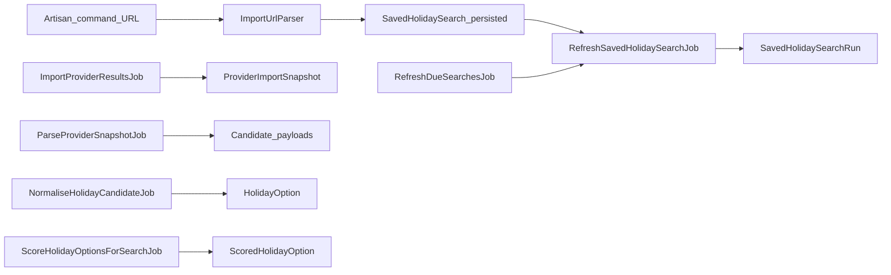

# HolidaySage — backend functionality plan (CLI-first)

This plan covers PHP/Laravel, queues, and the database. The **first deliverable is not web or API driven**: a **basic Artisan command** that takes a **single URL argument**, treats that URL as the seed for a `SavedHolidaySearch`, and lets the rest of the pipeline run downstream (import → parse → normalise → score).

Full HTTP CRUD, optional JSON API, and Blade/Inertia UIs are **explicitly deferred** until the command-driven flow is working end-to-end.

## Decisions (agreed before implementation)

- **URL parsing depth (v1):** Implement **`ImportUrlParser` with real criteria extraction** for Jet2 and/or TUI before the first end-to-end run (not URL-only or placeholder-only parsing). Use **sane defaults** only for fields the parser cannot derive.
- **Queueing:** **Default to the queue** (`RefreshSavedHolidaySearchJob` dispatched asynchronously). Expect **`php artisan horizon` or `queue:work`** to be running locally; document this in README or command help. Provide an optional **`--sync`** (or equivalent) for step-through debugging without a worker.
- **Provider fetch mode (updated):** **Live HTTP imports are now the default plan** for Jet2/TUI. Fixture snapshots remain available only as a fallback for offline/deterministic debugging.

## Current baseline

- [composer.json](composer.json): PHP 8.3, Laravel 11, Horizon.
- [routes/web.php](routes/web.php): Breeze + welcome only; no domain routes.
- [database/migrations/](database/migrations/): default `users` / `cache` / `jobs` only.

## Architecture (backend) — entry at the command

## 0) Primary entry: Artisan command (new)

**Signature (illustrative):** e.g. `php artisan holidaysage:run {url}` — exact name is an implementation detail.

**Behaviour:**

1. **Validate** the argument is a non-empty, parseable URL (Laravel `url` rule or `filter_var`).
2. **Resolve provider** from host/path (e.g. Jet2 vs TUI) and match to `provider_sources.key`.
3. **Call `ImportUrlParser`** for the matching provider: `parse($url)` returns an array of criteria (per spec § `ImportUrlParser` + `holiday_search_import_mappings`).
4. **Create a `SavedHolidaySearch` record**:
   - Set `provider_import_url` to the passed URL.
   - Apply parsed criteria to the corresponding fields; for any field the parser does not set, use **sane defaults** (MVP: minimal required fields from the spec—e.g. generated `name` from destination or “Import from {host}”, a unique `slug`, `status` = `active`, `duration_min_nights` / `max` if the parser does not supply them, party size defaults, etc.) so the row is valid and the pipeline can run.
   - Optionally write a `holiday_search_import_mappings` row with `original_url` + `extracted_criteria` JSON.
5. **Dispatch `RefreshSavedHolidaySearchJob`** for that search (with `run_type` = `import` or `manual` as appropriate) so all downstream work matches the spec’s job list.

**Developer ergonomics:** **Default = queued** (Horizon / `queue:work` required). Optional **`--sync`** to run the job chain without a separate worker for debugging; production remains queued + Horizon.

**No web routes** are required for this slice.

## 1) Schema and Eloquent layer

**Migrations** in the order specified in the doc (§ “Initial Migrations To Create”):

1. `provider_sources`
2. `saved_holiday_searches` (include `user_id` nullable for later auth)
3. `saved_holiday_search_runs`
4. `provider_import_snapshots`
5. `holiday_options` (with composite unique index / constraint matching spec guidance)
6. `scored_holiday_options`
7. `holiday_search_import_mappings`

**Models, enums, casts, seeder** — as in the previous plan (Jet2/TUI seed rows).

## 2) Validation — command-first, HTTP later

- **First:** URL validation and any minimal validation on the `SavedHolidaySearch` build inside the command (or a small `CreateSearchFromUrlAction` / DTO) so the persisted model is consistent.
- **Later:** `SavedHolidaySearchRequest` and **POST `/searches/import`** when web/API is added; the same `ImportUrlParser` output can power both the command and future HTTP prefill.

## 3) HTTP / API (deferred)

Do **not** block the MVP on [routes/web.php](routes/web.php) or `api.php` domain routes. When revisited:

- Full CRUD, `POST .../refresh`, results and run JSON/HTML — as in the spec § “API / Route Design”.
- Reuse the same services and jobs the command already uses.

## 4) Service interfaces and implementations

Unchanged in intent from the spec:

- **`ImportUrlParser`**: must be **implemented first enough** to support the command (Jet2/TUI registrars, `supports` / `parse`).
- **`ProviderSearchBuilder`**: builds provider query from the saved search (which may be URL-seeded) for `ImportProviderResultsJob`.
- **`HolidayScorer`**, **`HolidayOptionNormaliser`**: as before.

## 5) Jobs and run lifecycle

Same six jobs and run state machine as the spec. The **only change** to orchestration: the **normal** path to a first run is **Artisan → create search → `RefreshSavedHolidaySearchJob`**, not an HTTP `refresh` button.

**Provider implementations**: live HTTP clients for Jet2/TUI are the primary path. Stubs/fixtures are retained only as a controlled fallback for offline local development and troubleshooting.

## 6) Scheduler and infrastructure

Horizon + queues unchanged. `RefreshDueSearchesJob` remains relevant once searches have `next_refresh_due_at` set; URL-only CLI creation should still set `next_refresh_due_at` after a successful first run (per spec § “Due logic”).

## 7) Testing (backend)

- **Feature / console:** assert the command creates a `SavedHolidaySearch` with the URL and expected parsed fields, creates/dispatches a run (or performs sync pipeline with `--sync`).
- **Unit:** `ImportUrlParser` sample URLs, scorer, normalisation.
- Defer HTTP feature tests until routes exist.

## Suggested implementation order (CLI-first)

1. Migrations → models → enums → relationships → `ProviderSourceSeeder`.
2. **`ImportUrlParser`** (minimal Jet2 and/or TUI) + **Artisan command** that creates `SavedHolidaySearch` + `holiday_search_import_mappings` and dispatches `RefreshSavedHolidaySearchJob`.
3. `RefreshSavedHolidaySearchJob` + run lifecycle + live `ImportProviderResultsJob` (HTTP clients, retries, and throttling) + snapshot persistence.
4. Parse → normalise → `holiday_options` upsert.
5. `HolidayScorer` + `ScoreHolidayOptionsForSearchJob` + ranking.
6. `RefreshDueSearchesJob` + schedule.
7. Provider failure hardening (timeouts, non-200 responses, malformed payloads, partial provider outages).
8. **Then** (optional phase): form requests, web + API, full CRUD.
9. Tests and logging.

## Out of scope (this plan)

- Web/API and front-end until after the CLI path works.
- Laravel Scout, notifications, payments.
- Direct scraping patterns that violate provider terms or robots constraints (use compliant request patterns and conservative throttling).
