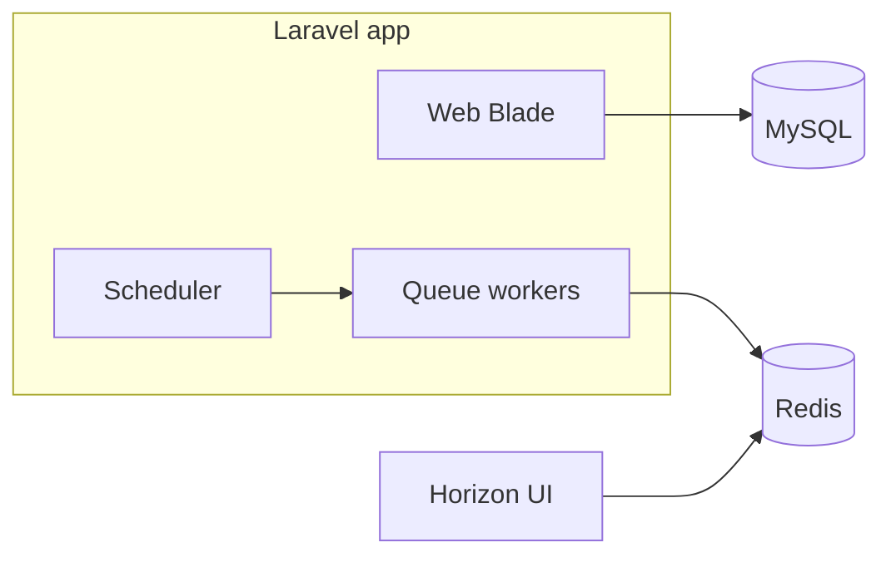

# Laravel-based stack for HolidaySage

## Context

- Application root: [`/Users/wade/Sites/holidaysage`](/Users/wade/Sites/holidaysage).
- [Build spec](docs/HolidaySage_Cursor_Ready_Build_Spec.md) allows Blade + Livewire **or** Inertia + Vue; **HolidaySage uses neither Livewire nor Inertia for the default stack** — server-rendered **Blade**, **Tailwind CSS**, and **Vite** only (Alpine.js optional later for small interactions, per spec).
- **No Laravel Sail.** Local development assumes **Laravel Herd** (or your own PHP + MySQL + Redis on the host), not Docker Compose.

## Target outcome

A runnable Laravel app in the repo root that:

- Meets PHP **8.3+** and Laravel **11+** (see `composer.json`).
- Uses **MySQL** (or MariaDB) and **Redis** for queues and cache (`QUEUE_CONNECTION=redis`, `CACHE_STORE=redis`) so **Horizon** can run.
- Ships **Blade + Tailwind + Vite** with no **Livewire** / **Volt** packages and no Sail.
- Has `.env.example` and README notes for **Herd**-style URLs (e.g. `http://holidaysage.test`) and local `DB_*` / `REDIS_*`.

This plan stops at **infrastructure and UI shell**. Domain migrations, models, and jobs are **Phase 1+** per the build spec.

## 1. Bootstrap the application in the repo root

If the directory is not empty (e.g. only `.git`), use a temp install then merge:

- `composer create-project laravel/laravel holidaysage-tmp "11.*"` then rsync into the repo preserving `.git`, **or** `laravel new` with a forced target if you use the installer.

Verify: `php artisan --version`, `php -v` (8.3+).

## 2. Database and Redis

- Set `DB_*` for local MySQL (Herd: typically `127.0.0.1`, database name of your choice, often `root` and empty password — adjust per machine).
- Set `REDIS_*` to local Redis; `QUEUE_CONNECTION=redis`, `CACHE_STORE=redis`; `SESSION_DRIVER` = `database` or `redis` as you prefer.
- Run `php artisan migrate` to confirm connectivity.

**Do not** add Sail, `compose.yaml`, or `laravel/sail` unless the team explicitly decides otherwise later.

## 3. Horizon

- `composer require laravel/horizon`, `php artisan horizon:install`.
- Ensure `QUEUE_CONNECTION=redis` and Horizon supervisors suit local vs production.
- Document: run `php artisan horizon` locally when exercising queues; dashboard path `/horizon` (gate for non-local as needed).

## 4. Scheduler (foundation only)

- In [`routes/console.php`](routes/console.php), leave **comments only** for future `Schedule::…` entries (e.g. `RefreshDueSearchesJob` in Phase 6) — do not implement that job in this step.
- Production: single cron entry `* * * * * cd /path-to-project && php artisan schedule:run`.

## 5. Frontend: Blade + Tailwind + Vite (no Livewire)

- Use **Laravel Breeze with the Blade stack** (`php artisan breeze:install blade`) **or** equivalent minimal Blade layouts + Tailwind + Vite if you skip Breeze.
- **Remove** `livewire/livewire`, `livewire/volt`, and any Breeze Livewire/Volt routes, providers, views, and tests if they were added by mistake.
- Run `npm install` / `npm run build` to confirm the asset pipeline.

**Do not** create empty directories or `.gitkeep` placeholders under `app/` for future domain code — add `Actions/`, `Services/`, etc. when you first need them.

## 6. Quality and verification checklist

| Check | Command / action |
|--------|------------------|
| App boots | Herd site or `php artisan serve` |
| DB | `php artisan migrate` |
| Queues + Horizon | Dispatch a trivial job; `php artisan queue:work redis --once` or Horizon |
| Assets | `npm run dev` or `npm run build` |
| Config cache | `php artisan config:cache` (CI-style); then `config:clear` locally if desired |
| Tests | `php artisan test` (e.g. SQLite `:memory:` in `phpunit.xml` for feature tests) |

## 7. Explicitly out of scope for this step

- Domain migrations (`provider_sources`, `saved_holiday_searches`, …).
- Eloquent domain models, enums, seeders, import/scoring jobs.
- Scout, S3, Jet2/TUI integrations.
- **Livewire, Volt, Inertia, Sail.**
- Empty `app/` directory trees or `.gitkeep` scaffolding “for later”.

## 8. Dependency diagram (stack layer)

## 9. Risk notes

- **Non-empty repo + create-project:** use temp directory + rsync or installer `--force` as needed.
- **Laravel major version:** lock to 11.x in `composer.json` if you want strict “11+” alignment.
- **Horizon on macOS:** requires a working local **Redis** (e.g. via Herd); no Sail requirement.
- **Codebase drift:** if an earlier bootstrap added Livewire Breeze, complete the `blade-tailwind-vite` todo to strip it and reinstall Blade Breeze so the repo matches this plan.
